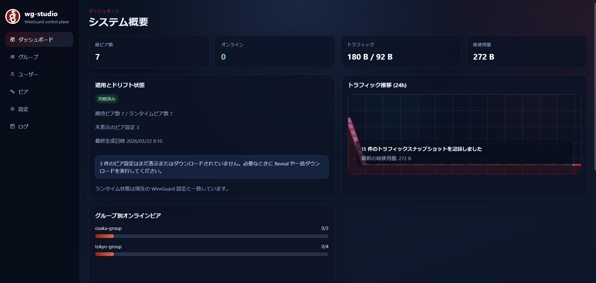

# Overview

Purpose: explain what `wg-studio` is, what it currently does, and what it intentionally does not do.

Audience:

- operators evaluating the current feature set
- developers needing a short product summary before deeper docs

Related docs:

- [`architecture.md`](architecture.md)
- [`domain-model.md`](domain-model.md)
- [`config-and-apply.md`](config-and-apply.md)
- [`../planning/roadmap.md`](../planning/roadmap.md)

`wg-studio` manages WireGuard desired state outside the WireGuard data plane.

It stores groups, users, peers, allocation policy, login users, and endpoint settings in PostgreSQL, then generates and applies WireGuard configuration from that state.

Core goals:

- manage VPN segments through `Group -> User -> Peer`
- support group defaults plus per-user overrides
- generate server and client artifacts from DB state
- apply changes to a live WireGuard runtime
- expose runtime status through the bundled GUI and the API

Current product capabilities:

- PostgreSQL-backed domain state
- separate audit-oriented GUI log stream
- group, user, and peer lifecycle operations
- peer config and QR generation with one-time reveal semantics
- direct config and QR downloads from the reveal modal
- warning-confirmed group and user bundle download with key reissue
- full DB backup / restore scripts for recovery workflows
- JSON export and import for current control-plane state
- server config generation and apply flow
- apply-before-change diff preview before runtime update confirmation
- drift and apply-state visibility on the dashboard
- direct dashboard apply action when runtime drift is detected
- informational visibility for peer configs that have not been revealed or downloaded yet
- operational `/network` graph with relationship focus, traffic visibility, endpoint details, and persisted filters
- dangerous-operation confirmations around reissue and import flows
- Docker-based deployment path
- live peer traffic and handshake status
- bundled React/Vite GUI through `nginx`

Current non-goals:

- firewall enforcement plugins
- multi-server or multi-tenant orchestration inside one control plane
- multi-interface or multi-instance orchestration inside one domain model
- WebSocket-based realtime updates

Scope note:

- `v1.0.0` does not introduce an `Instance` model above `Group`
- if multiple WireGuard runtimes are needed, the preferred direction is another container or another `wg-studio` stack
- `wg1`, `wg2`, or similar split-interface deployments should be modeled as separate runtimes, not extra interfaces inside one domain model
