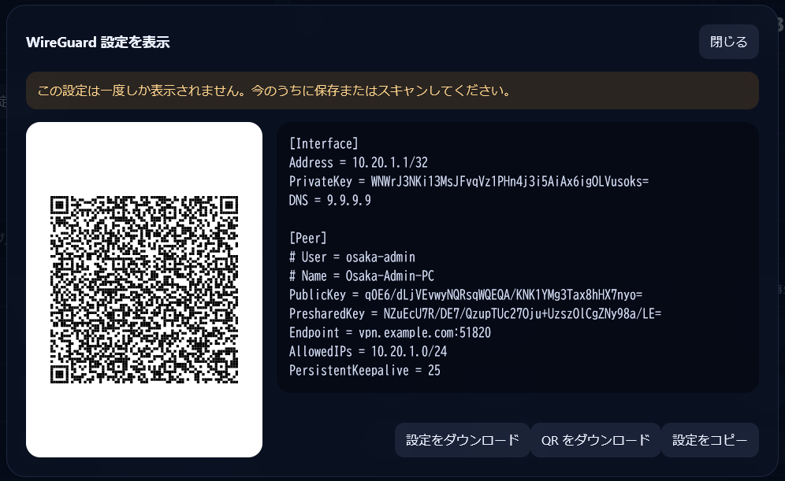

# Quick Start

Purpose: provide the shortest reliable path to a running `wg-studio` stack with the bundled GUI.

Audience:

- first-time operators
- developers who need a clean local or server startup flow

Related docs:

- [`../current/overview.md`](../current/overview.md)
- [`../current/config-and-apply.md`](../current/config-and-apply.md)
- [`development.md`](development.md)

This is the shortest path to a running `wg-studio` stack with the GUI enabled.


## 1. Create `.env`

Use the checked-in template:

```bash
cp .env.example .env
```

Change at least these values:

- `WG_SERVER_ENDPOINT`
- `WG_JWT_SECRET_KEY`

Optional but recommended:

- `WG_BOOTSTRAP_ADMIN_USERNAME`
- `WG_BOOTSTRAP_ADMIN_PASSWORD`

Recommended:

- keep `WG_CORS_ALLOWED_ORIGINS` empty when using the bundled GUI on `nginx`
- only set `WG_CORS_ALLOWED_ORIGINS` when serving another frontend origin

## 2. Start The Stack

```bash
docker compose up -d --build
```

Default services:

- `postgres`
- `wireguard`
- `wg-studio-api`
- `wg-studio-web`

Profile-scoped services that do not start by default:

- `wg-studio-cli` (`tools`)
- `wg-studio-e2e` (`test`)

## 3. Open The GUI

The bundled GUI is served by `nginx` on host port `3900`.

```text
http://localhost:3900/wg-studio/
```

First login behavior:

- if `WG_BOOTSTRAP_ADMIN_USERNAME` and `WG_BOOTSTRAP_ADMIN_PASSWORD` are set, startup creates the first login user automatically
- if no login users exist, the login screen switches into first-admin setup mode

## 4. Sanity Checks

Check API health from inside the stack:

```bash
docker compose exec wg-studio-api python -c "import urllib.request; print(urllib.request.urlopen('http://127.0.0.1:8000/health').read().decode())"
```

Run a CLI command:

```bash
docker compose --profile tools run --rm wg-studio-cli group list
```

## 5. First GUI Workflow

Suggested first pass:

1. create a `Group`
2. create a `User` inside that group
3. create a `Peer`
4. use `Reveal` once to obtain the peer config
5. download the peer `.conf` or QR directly from the reveal modal
6. use `Apply config` to sync the server config into WireGuard

Example reveal view:



Optional admin workflows:

- use the dashboard to confirm drift state before and after apply
- download a group or user peer bundle when rotating multiple peers at once
- export current control-plane state as JSON before larger maintenance changes

## Notes

- The API is internal-only by default in Compose.
- The GUI is the intended entry point for normal admin use.
- Generated peer configs and QR artifacts are stored in the shared Docker volume `wg_config`.
- If you need a separate WireGuard runtime such as `wg1`, use another container or another `wg-studio` stack.
