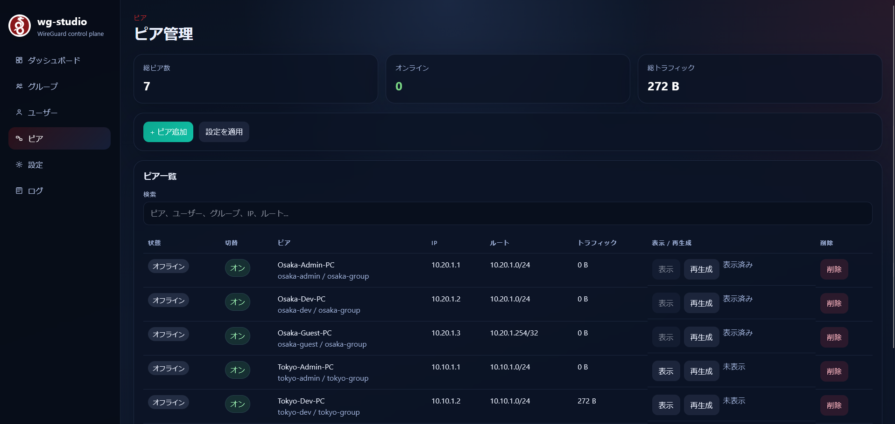

# クイックスタート

目的:

- `wg-studio` を最短で起動する
- GUI まで辿り着く

想定読者:

- 初回セットアップを行う運用者
- ローカルや検証環境で素早く立ち上げたい開発者

関連資料:

- [`../current/overview.md`](../current/overview.md)
- [`../current/config-and-apply.md`](../current/config-and-apply.md)
- [`development.md`](development.md)



## 1. 環境変数を用意する

```bash
cp .env.example .env
```

最低限見直す値:

- `WG_SERVER_ENDPOINT`
- `WG_JWT_SECRET_KEY`

初回ログインを自動作成したい場合:

- `WG_BOOTSTRAP_ADMIN_USERNAME`
- `WG_BOOTSTRAP_ADMIN_PASSWORD`

## 2. スタックを起動する

```bash
docker compose up -d --build
```

標準で起動するサービス:

- `postgres`
- `wireguard`
- `wg-studio-api`
- `wg-studio-web`

必要なときだけ使う profile 付きサービス:

- `wg-studio-cli`（`tools`）
- `wg-studio-e2e`（`test`）

## 3. GUI を開く

```text
http://localhost:3900/wg-studio/
```

## 4. 初回ログイン

- bootstrap 管理者を環境変数で設定している場合は、そのユーザーでログインします
- ログインユーザーが 0 件の場合は、ログイン画面が初回管理者作成モードに切り替わります

## 5. 最初の運用フロー

1. Group を作成する
2. User を作成する
3. Peer を作成する
4. 必要なら `Reveal` で設定を表示し、`.conf` または QR をダウンロードする
5. `Apply` で WireGuard ランタイムに反映する
6. Dashboard でドリフト状態と通信状態を確認する

## 補足

- `wg-studio` `v1.0.0` は 1 スタックにつき 1 WireGuard ランタイム前提です
- `wg1` や別系統のランタイムを持ちたい場合は、別コンテナまたは別 `wg-studio` スタックで分けて運用します
- CLI を使うときは `docker compose --profile tools run --rm wg-studio-cli ...` を使います
- E2E smoke を回すときは `docker compose --profile test run --rm wg-studio-e2e` を使います
